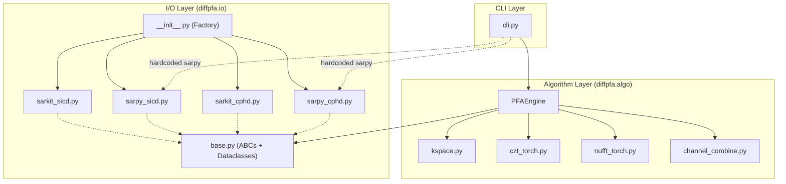

---

# diffpfa — Code Audit Report

**Date**: 2026-08-08  
**Auditor**: Antigravity (AI Code Auditor)  
**Scope**: Full repository review — architecture, correctness, code quality, testing, packaging  
**Commit**: `5c76919` (Initial release)

---

## 1. Executive Summary

`diffpfa` is a well-structured PyTorch-based Polar Format Algorithm (PFA) processor that forms SAR images from CPHD data. The project demonstrates strong domain expertise in SAR signal processing and thoughtful architectural decisions (I/O abstraction, multi-backend support, differentiable algorithms). However, several issues across code quality, abstraction leaks, code duplication, and test infrastructure need attention before this could be considered production-ready.

### Severity Breakdown

| Severity | Count | Description |
|----------|-------|-------------|
| 🔴 Critical | 4 | Bugs or design flaws that cause incorrect behavior or runtime failures |
| 🟠 Major | 7 | Significant code quality, correctness, or maintainability issues |
| 🟡 Minor | 6 | Style, packaging, and polish items |

---

## 2. Architecture Overview



> **NOTE:** The I/O abstraction is well-designed at the base class level, but several components bypass it (CLI hardcodes sarpy, PFAEngine reaches through the abstraction to access raw backend objects).

---

## 3. Critical Issues (🔴)

### 3.1 Polarization Extraction Broken in BOTH Backends

**Verified with live data** against the UMBRA CPHD file. Both backends produce `tx_pol = "UNKNOWN"` and `rcv_pol = "UNKNOWN"`, resulting in all output files being named `SICD_U_UNKNOWN_UNKNOWN.nitf`.

**Root cause**: In the CPHD 1.1.0 schema, `TxPol` and `RcvPol` are nested under a `Polarization` sub-element, not directly under `Channel/Parameters`:

```xml
<Channel>
  <Parameters>
    <Identifier>Primary</Identifier>
    <Polarization>          <!-- Both backends miss this level -->
      <TxPol>X</TxPol>
      <RcvPol>X</RcvPol>
    </Polarization>
  </Parameters>
</Channel>
```

**Sarpy backend** ([sarpy_cphd.py](../diffpfa/io/sarpy_cphd.py) lines 109-110):
```python
# BROKEN: TxPol is not a direct attribute of ChannelParametersType
tx_pol = getattr(params, "TxPol", None)    # Always returns None
rcv_pol = getattr(params, "RcvPol", None)  # Always returns None
```

Verified output:
```
getattr(params, "TxPol", None) = None
params.Polarization.TxPol = X       ← correct access path
```

**Sarkit backend** ([sarkit_cphd.py](../diffpfa/io/sarkit_cphd.py) lines 121-124):
```python
# BROKEN: XPath looks for TxPol directly under Parameters, not under Polarization
tp = params_node.find("./{*}TxPol")    # Always returns None
rp = params_node.find("./{*}RcvPol")   # Always returns None
```

Verified output:
```
Direct TxPol: None
Polarization/TxPol: X                 ← correct XPath
```

The PVP fallback (`pvp_dict["TxPol"]`) also fails because `TxPol`/`RcvPol` are not standard PVP fields — they are fixed per-channel metadata.

#### Remediation Plan

**Sarpy fix** (`sarpy_cphd.py`):
```python
# Replace lines 109-110 with:
pol = getattr(params, "Polarization", None)
tx_pol = getattr(pol, "TxPol", None) if pol is not None else None
rcv_pol = getattr(pol, "RcvPol", None) if pol is not None else None
```

**Sarkit fix** (`sarkit_cphd.py`):
```python
# Replace lines 121-124 with:
pol_node = params_node.find("./{*}Polarization")
if pol_node is not None:
    tp = pol_node.find("./{*}TxPol")
    if tp is not None: tx_pol = tp.text
    rp = pol_node.find("./{*}RcvPol")
    if rp is not None: rcv_pol = rp.text
```

**Add a regression test** (`tests/test_polarization.py`):
```python
def test_polarization_not_unknown(cphd_reader):
    ch_data = cphd_reader.read_channel(cphd_reader.get_channel_names()[0])
    assert ch_data.tx_pol != "UNKNOWN", f"TxPol extraction failed: got {ch_data.tx_pol}"
    assert ch_data.rcv_pol != "UNKNOWN", f"RcvPol extraction failed: got {ch_data.rcv_pol}"
```

---

### 3.2 Abstraction Leak: PFAEngine Reaches Through Reader to Raw Backend

**Files**: [pfa_engine.py](../diffpfa/algo/pfa_engine.py) — Lines 163, 345, 531  

When `image_plane == "Slant"`, the engine does:
```python
raw_meta = self.reader.reader.cphd_meta  # Reaches through abstraction!
rg = raw_meta.ReferenceGeometry
srp = rg.SRP.get_array()
arp = rg.Monostatic.ARPPos.get_array()
arp_v = rg.Monostatic.ARPVel.get_array()
```

This code:
1. **Assumes sarpy backend** — `self.reader.reader.cphd_meta` is a sarpy-specific API. Crashes with `AttributeError` if using `SarkitCPHDReader`.
2. **Violates the entire I/O abstraction** the project was designed around.
3. **Is duplicated identically 3 times** (once per processing mode).

#### Remediation Plan
Add Reference Geometry fields to `CPHDMetadata` in [base.py](../diffpfa/io/base.py):
```python
@dataclass
class CPHDMetadata:
    # ... existing fields ...
    srp_ecf: Optional[np.ndarray] = None        # Scene Reference Point (3,)
    arp_pos_coa: Optional[np.ndarray] = None     # ARP position at COA (3,)
    arp_vel_coa: Optional[np.ndarray] = None     # ARP velocity at COA (3,)
```
Then populate these in both `SarpyCPHDReader.get_metadata()` and `SarkitCPHDReader.get_metadata()`, and refactor the Slant plane logic out of each processing method into a shared helper that uses only `CPHDMetadata`.

---

### 3.3 Unconditional Sarpy Import in `io/__init__.py` Breaks Sarkit-Only Environments

**File**: [diffpfa/io/\_\_init\_\_.py](../diffpfa/io/__init__.py) — Lines 8-9

```python
from diffpfa.io.sarpy_cphd import SarpyCPHDReader  # Top-level import!
from diffpfa.io.sarpy_sicd import SarpySICDWriter   # Top-level import!
```

If `sarpy` is not installed, `import diffpfa.io` fails immediately with `ImportError`, even though the `_get_backend()` function and factory functions are designed to support sarkit-only environments.

#### Remediation Plan
Remove the top-level sarpy imports. The factories already do lazy imports for sarkit — apply the same pattern for sarpy:

```python
# Remove these two lines from __init__.py top-level:
# from diffpfa.io.sarpy_cphd import SarpyCPHDReader
# from diffpfa.io.sarpy_sicd import SarpySICDWriter

def CPHDReader(file_path: str, backend: str = "auto") -> BaseCPHDReader:
    selected_backend = _get_backend(backend)
    if selected_backend == "sarkit":
        from diffpfa.io.sarkit_cphd import SarkitCPHDReader
        return SarkitCPHDReader(file_path)
    elif selected_backend == "sarpy":
        from diffpfa.io.sarpy_cphd import SarpyCPHDReader  # Lazy import
        return SarpyCPHDReader(file_path)
```

Also update `__all__` to only export the factory functions and base classes, not concrete implementations.

---

### 3.4 CLI Hardcodes Sarpy Backend, Bypasses Factory System

**File**: [cli.py](../diffpfa/cli.py) — Lines 6, 27-28

```python
from diffpfa.io import SarpyCPHDReader, SarpySICDWriter  # Hardcoded!
# ...
reader = SarpyCPHDReader(args.cphd_path)
writer = SarpySICDWriter()
```

The CLI ignores the `CPHDReader()` / `SICDWriter()` factory functions entirely, meaning users can never benefit from the sarkit backend via the CLI.

#### Remediation Plan
```python
from diffpfa.io import CPHDReader, SICDWriter

reader = CPHDReader(args.cphd_path, backend="auto")
writer = SICDWriter(backend="auto")
```

Optionally add a `--backend` CLI flag for explicit selection.

---

## 4. Major Issues (🟠)

### 4.1 Massive Code Duplication Across Three Processing Modes

**File**: [pfa_engine.py](../diffpfa/algo/pfa_engine.py)

The three methods `process_channel_czt()` (Lines 122-306), `process_channel_hybrid()` (Lines 308-490), and `process_channel_nufft()` (Lines 494-596) share ~80% identical code:

| Shared Code Block | Purpose |
|---|---|
| RVP deskew | Lines 139-148 ≈ 324-333 ≈ 510-519 |
| Subpatch setup | Lines 150-154 ≈ 335-339 ≈ 521-525 |
| Look vector computation | Lines 156-180 ≈ 341-362 ≈ 527-548 |
| Slant plane computation | Lines 159-180 ≈ 344-362 ≈ 530-548 |
| Subpatch loop + SCP shift | Lines 185-213 ≈ 367-407 ≈ 553-580 |
| `scipy.fft.next_fast_len` import | Lines 218 ≈ 399 (inside loop!) |

#### Remediation Plan
Extract shared logic into private methods:
```python
def _deskew_rvp(self, signal, pvp, N_samples) -> torch.Tensor
def _get_image_plane_vectors(self, cphd_meta) -> Tuple[torch.Tensor, torch.Tensor]  
def _compute_subpatch_geometry(self, ...) -> SubpatchContext
```

Then each `process_channel_*` method only implements its unique interpolation kernel.

---

### 4.2 Hybrid Mode: Incomplete Deconvolution (Range Dimension Missing)

**File**: [pfa_engine.py](../diffpfa/algo/pfa_engine.py) — Lines 476-482

The hybrid mode applies NUFFT Kaiser-Bessel deconvolution only in the **cross-range** dimension:
```python
deconv_u = torch.i0(...)  # Cross-range only
img_deconv = img_shifted / (deconv_u.unsqueeze(1) + 1e-12)  # 1D deconv!
```

The range dimension was gridded via CZT (which doesn't need deconvolution), so this is actually **correct** — but the variable naming is confusing (`img_deconv` suggests full 2D deconvolution) and there is no comment explaining why range deconvolution is intentionally skipped.

#### Remediation Plan
Add a clear comment:
```python
# Range dimension was resampled via CZT (exact interpolation) — no deconvolution needed.
# Only deconvolve the cross-range dimension which used NUFFT Kaiser-Bessel gridding.
```

---

### 4.3 `scipy.fft.next_fast_len` Imported Inside Hot Loops

**Files**: [pfa_engine.py](../diffpfa/algo/pfa_engine.py) Lines 218, 399; [nufft_torch.py](../diffpfa/algo/nufft_torch.py) Lines 45, 96, 200

```python
for i_u in range(0, N_u, subpatch_size_u):
    for i_r in range(0, N_r, subpatch_size_r):
        # ...
        from scipy.fft import next_fast_len  # Imported inside nested loop!
        M_u = next_fast_len(...)
```

While Python caches module imports, this is poor practice — it obscures dependencies, confuses static analyzers, and adds unnecessary overhead per iteration.

#### Remediation Plan
Move all `from scipy.fft import next_fast_len` to the top of each module file.

---

### 4.4 Sarkit Backend Missing ImageArea/ExtendedArea Parsing

**File**: [sarkit_cphd.py](../diffpfa/io/sarkit_cphd.py) — Lines 53-54

```python
# ImageArea (not fully implemented in sarkit wrapper, keeping simple)
img_area = None
ext_area = None
```

When `image_area_mode="ImageArea"` (the default), `_determine_spatial_bounds()` falls through to the resolution-based fallback. This means **sarkit users get different (and likely wrong) image bounds** compared to sarpy users processing the same CPHD file.

#### Remediation Plan
Parse `ImageArea` from the XML tree in the sarkit reader:
```python
ia_node = xmltree.find(".//{*}SceneCoordinates/{*}ImageAreaCornerPoints")
# or:
ia_node = xmltree.find(".//{*}SceneCoordinates/{*}ImageArea")
if ia_node is not None:
    x1y1 = ia_node.find("./{*}X1Y1")
    x2y2 = ia_node.find("./{*}X2Y2")
    # ... parse into ImageAreaBounds
```

---

### 4.5 NUFFT 2D Uses `index_put_` with `accumulate=True` — Not Differentiable on CUDA

**File**: [nufft_torch.py](../diffpfa/algo/nufft_torch.py) — Lines 252-256

```python
grid.index_put_(
    (iu[mask], ir[mask]),
    sig_b[mask] * w_2d[mask],
    accumulate=True
)
```

`index_put_` with `accumulate=True` has [known limitations with autograd on CUDA](https://pytorch.org/docs/stable/generated/torch.Tensor.index_put_.html) — specifically, it is non-deterministic on GPU and the gradient computation may be incorrect when indices collide. This directly conflicts with the project's stated goal of differentiability.

The `nufft_grid_1d` function has the same issue (Line 70-74), and `nufft_1d_type1_torch` uses `index_add_` (Line 127) which is better but still non-deterministic on CUDA.

#### Remediation Plan
For reliable differentiability:
- Use `torch.scatter_add` on a flattened grid, or
- Consider wrapping with `torch.use_deterministic_algorithms(True)` for correctness validation, or
- Investigate `torch_scatter` or custom CUDA kernels for deterministic scatter-accumulate.

---

### 4.6 `torch.compile` Mutates Global State

**File**: [pfa_engine.py](../diffpfa/algo/pfa_engine.py) — Lines 59-65

```python
if self.config.enable_compile:
    global czt_1d_torch, nufft_1d_type1_torch, nufft_2d_type1_torch
    import torch._dynamo as dynamo
    dynamo.config.suppress_errors = True
    czt_1d_torch = torch.compile(czt_1d_torch)
    # ...
```

This replaces module-level function references, meaning:
1. If two `PFAEngine` instances are created (one with compile, one without), the second sees the compiled version regardless.
2. `suppress_errors = True` silently swallows Dynamo compilation failures — dangerous for debugging.

#### Remediation Plan
Use instance-level compiled functions instead of mutating globals:
```python
if self.config.enable_compile:
    self._czt_fn = torch.compile(czt_1d_torch)
    self._nufft_1d_fn = torch.compile(nufft_1d_type1_torch)
else:
    self._czt_fn = czt_1d_torch
    # ...
```

---

### 4.7 `czt_resample_kspace_1d` Parameter Name Mismatch

**File**: [czt_torch.py](../diffpfa/algo/czt_torch.py) — Line 126

The parameter `L_r` is named for "range extent" but it is also used for cross-range resampling:
```python
# pfa_engine.py line 283-284 (cross-range CZT call):
batch_out_t = czt_resample_kspace_1d(
    range_batch_t,
    ...
    L_r=L_u,        # ← Confusing: passing L_u into parameter named L_r
    oversample=oversample
)
```

The parameter should be named `L` or `spatial_extent` since it represents a generic spatial extent, not exclusively range.

---

## 5. Minor Issues (🟡)

### 5.1 No `setup.py`, `pyproject.toml`, or `requirements.txt`

The project has no packaging configuration at all. Dependencies (`torch`, `numpy`, `scipy`, `lxml`, `sarpy`/`sarkit`, `matplotlib`) are implicit.

#### Remediation Plan
Create a `pyproject.toml` with:
- Package metadata and version (sync with `__init__.py.__version__`)
- Dependencies with version bounds
- Optional dependency groups (`[sarpy]`, `[sarkit]`, `[dev]`)
- Entry point for CLI: `diffpfa = diffpfa.cli:main`

---

### 5.2 `conftest.py` Uses `sys.path` Hacking

**File**: [conftest.py](../conftest.py)

```python
sys.path.insert(0, os.path.abspath(os.path.dirname(__file__)))
```

This is fragile and unnecessary with proper packaging (`pip install -e .`).

---

### 5.3 `visualize_sicd.py` Only Supports Sarpy

**File**: [visualize_sicd.py](../visualize_sicd.py) — Line 4

```python
import sarpy.io.complex as sarpy_complex
```

Should use the factory pattern or at minimum try sarkit first.

---

### 5.4 `test_outputs/` Committed to Git with ~1.7GB of NITF Data

The `.gitignore` lists `test_outputs/` but the directory contains ~1.7GB of NITF files that appear to be tracked. Large binary artifacts should not be in the repository.

---

### 5.5 Vim Swap File Committed

**File**: `tests/.test_pfa.py.swp` (16KB) — an editor artifact that should be gitignored.

---

### 5.6 Hardcoded Oversample Factor `1.5`

As noted in the project's own TODO, the NUFFT oversample factor is hardcoded to `1.5` in multiple locations. This should be configurable via `PFAConfig`.

---

## 6. Test Suite Assessment

### Current State

| File | Type | Assertions | Data Dependency | CI-Safe |
|------|------|-----------|----------------|---------|
| [test_pfa.py](../tests/test_pfa.py) | Pytest | ✅ (2 unit, 4 integration) | Hardcoded path | ⚠️ Partial |
| [test_grid.py](../tests/test_grid.py) | Script | ❌ None | Hardcoded path | ❌ Crashes |
| [test_mem.py](../tests/test_mem.py) | Script | ❌ None | Hardcoded path + CUDA | ❌ Crashes |
| [test_metadata.py](../tests/test_metadata.py) | Script | ❌ None | Hardcoded path | ❌ Crashes |
| [test_txpos.py](../tests/test_txpos.py) | Script | ❌ None | Hardcoded path | ❌ Crashes |
| [test_err.py](../tests/test_err.py) | Script | ❌ None | None | ⚠️ No-op |
| [test_lxml.py](../tests/test_lxml.py) | Script | ❌ None | None | ⚠️ No-op |
| [test_sarkit.py](../tests/test_sarkit.py) | Script | ❌ None | None | ⚠️ No-op |
| [compare_modes.py](../tests/compare_modes.py) | CLI tool | ❌ None | CLI arg | ❌ Manual |

### Critical Anti-Patterns

1. **Silent skip masquerading as pass** — `test_pfa.py` uses `return` instead of `pytest.skip()` when data is missing. CI reports 6/6 tests PASSED when only 2 actually ran.
2. **Top-level execution in test files** — `test_grid.py`, `test_mem.py`, `test_metadata.py`, `test_txpos.py` execute code at module import time. Pytest test discovery will crash if the CPHD file is missing.
3. **No synthetic test data** — Every integration test requires a proprietary 1GB+ CPHD file at a hardcoded absolute path.
4. **Hardcoded `device="cuda"`** — Integration tests in `test_pfa.py` fail on CPU-only machines.

### Remediation Plan for Tests

#### Phase 1: Fix existing tests (1-2 days)
1. Replace `if not os.path.exists(...): return` with `pytest.skip("CPHD data not found")` in `test_pfa.py`
2. Add `@pytest.mark.skipif(not torch.cuda.is_available(), reason="CUDA required")` to GPU tests
3. Parameterize device: `@pytest.mark.parametrize("device", ["cpu"] + (["cuda"] if torch.cuda.is_available() else []))`
4. Extract `SAMPLE_CPHD_PATH` to a `conftest.py` fixture or environment variable

#### Phase 2: Reorganize scripts (1 day)
1. Move `test_err.py`, `test_lxml.py`, `test_sarkit.py` to `scripts/` or delete them
2. Move `test_mem.py` to `benchmarks/`
3. Move `compare_modes.py` to `scripts/` or `tools/`
4. Convert `test_grid.py`, `test_metadata.py`, `test_txpos.py` into proper pytest functions with assertions

#### Phase 3: Synthetic test fixtures (2-3 days)
Create a synthetic CPHD-like fixture that generates a known point-target response in k-space:
```python
@pytest.fixture
def synthetic_channel_data():
    """Creates a synthetic single-point-target CPHD channel for testing."""
    N_pulses, N_samples = 64, 128
    # Generate ideal point target at SRP
    signal = torch.ones(N_pulses, N_samples, dtype=torch.complex128)
    pvp = {
        "SRPPos": np.tile([0, 0, 6378137.0], (N_pulses, 1)),
        "RcvPos": ...,  # Synthetic orbit positions
        "SC0": ...,
        "SCSS": ...,
    }
    return CPHDChannelData(...)
```

This enables CI-safe testing of:
- K-space computation correctness
- CZT / NUFFT / Hybrid image formation accuracy (point spread function tests)
- Channel alignment logic
- Spatial bounds computation

#### Phase 4: Coverage targets
| Component | Current Coverage | Target |
|-----------|-----------------|--------|
| `kspace.py` | `compute_look_components` only | All 4 functions |
| `czt_torch.py` | `czt_1d_torch` only | + `czt_resample_kspace_1d` |
| `nufft_torch.py` | None | `kaiser_bessel_kernel_1d`, `nufft_grid_1d`, `nufft_2d_type1_torch` |
| `channel_combine.py` | None | `align_and_combine_channels` (single + multi-channel) |
| `pfa_engine.py` | Integration only | `_determine_spatial_bounds` unit tests |
| `io/base.py` | None | Dataclass validation |
| **Polarization** | **None** | **Both backends extract TxPol/RcvPol correctly** |

---

## 7. Differentiability Audit

The project's README states: *"The core algorithms MUST be implemented in PyTorch and remain differentiable with respect to the raw signal tensor."*

| Component | Differentiable? | Notes |
|-----------|----------------|-------|
| CZT (`czt_1d_torch`) | ✅ Yes | All operations use standard torch ops |
| CZT Resample (`czt_resample_kspace_1d`) | ✅ Yes | Composition of differentiable CZTs |
| NUFFT 2D (`nufft_2d_type1_torch`) | ⚠️ Questionable | `index_put_` with `accumulate=True` is non-deterministic on CUDA |
| NUFFT 1D (`nufft_1d_type1_torch`) | ⚠️ Questionable | `index_add_` is non-deterministic on CUDA |
| NUFFT Grid 1D (`nufft_grid_1d`) | ⚠️ Questionable | Same `index_put_` issue |
| KB Kernel | ✅ Yes | `torch.i0` is differentiable |
| Channel Combine | ✅ Yes | Standard torch ops |
| RVP Deskew | ✅ Yes | Elementwise complex multiply |
| K-space Computation | ✅ Yes | `torch.linalg.norm`, dot products |

> **WARNING:** The NUFFT gridding operations are the weakest link for differentiability. While they will produce *a* gradient via autograd, the gradient may be **incorrect or non-deterministic on GPU** due to race conditions in scatter-accumulate operations. This should be validated with a finite-difference gradient check before relying on it for autofocus workflows.

---

## 8. Priority-Ordered Remediation Roadmap

| Priority | Issue | Effort | Impact |
|----------|-------|--------|--------|
| **P0** | §3.1 — Polarization broken in both backends | 1 hr | Metadata correctness |
| **P0** | §3.2 — Slant plane abstraction leak (crashes with sarkit) | 2-3 hrs | Correctness |
| **P0** | §3.3 — Unconditional sarpy import (crashes without sarpy) | 30 min | Usability |
| **P0** | §3.4 — CLI hardcodes sarpy backend | 15 min | Usability |
| **P1** | §4.4 — Sarkit missing ImageArea parsing | 2-3 hrs | Correctness |
| **P1** | §4.1 — Extract duplicated code into shared methods | 3-4 hrs | Maintainability |
| **P1** | §6 Phase 1 — Fix test anti-patterns | 1-2 hrs | CI reliability |
| **P2** | §4.5 — NUFFT scatter differentiability | 4-6 hrs | Correctness (ML) |
| **P2** | §4.6 — torch.compile global mutation | 1 hr | Correctness |
| **P2** | §6 Phase 2-3 — Test reorg + synthetic fixtures | 2-3 days | Test coverage |
| **P3** | §5.1 — Add pyproject.toml | 1-2 hrs | Packaging |
| **P3** | §5.4 — Remove tracked NITF binaries | 30 min | Repo hygiene |
| **P3** | §4.3 — Move imports out of loops | 15 min | Code quality |
| **P3** | §4.7 — Rename `L_r` parameter | 15 min | Readability |
| **P3** | §5.5 — Remove swap file | 5 min | Repo hygiene |

---

## 9. Positive Observations

To be fair, there is a lot of solid work here:

1. **Clean I/O abstraction at the base level** — `BaseCPHDReader`, `BaseSICDWriter`, and the dataclass contracts are well-designed and provide genuine backend independence.
2. **Factory pattern** — The `CPHDReader()` / `SICDWriter()` factory functions with auto-detection are a good pattern (once the import bug is fixed).
3. **Rigorous phase geometry** — Using `torch.linalg.norm(P_vecs)` for true 3D slant-range distances rather than small-angle approximations is the correct approach.
4. **Memory-conscious batching** — The batched processing loops with configurable `czt_batch_size` and `nufft_batch_size_pts` plus explicit `del` + `torch.cuda.empty_cache()` calls show awareness of GPU memory constraints.
5. **Multi-algorithm support** — Offering CZT, NUFFT, and Hybrid modes with subpatching is a sophisticated approach that gives users flexibility between speed and accuracy.
6. **`compare_modes.py`** — While not a proper test, this tool demonstrates good engineering judgment by comparing phase differences against the "ground truth" NUFFT implementation.
7. **Correct CZT implementation** — The Bluestein-based CZT appears mathematically correct (validated by the `test_czt_1d_accuracy` test against scipy).
